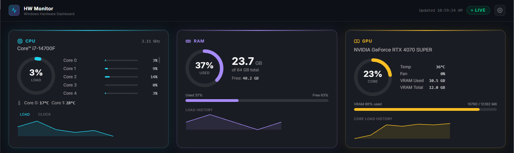

# Hardware Monitor for Windows

Real-time hardware monitoring dashboard for Windows machines — CPU, RAM, and
GPU metrics streamed live to a browser via **GraphQL subscriptions over
WebSocket**.

<p align="center">
  
  
  
    
</p>

## Repository Layout

```
hardware-monitor-win/
├── server/   Apollo GraphQL server — polls hardware, publishes via WebSocket
└── ui/       React 19 dashboard — subscribes and renders live gauges & charts
```

## Architecture Overview

```
┌─────────────────────────────────────────────────────────────────┐
│  Windows Host                                                   │
│                                                                 │
│  ┌──────────────┐  REST/:5390   ┌────────────────────────────┐ │
│  │  Collector   │─────────────▶│  Apollo GraphQL Server     │ │
│  │  (npm run    │               │  HTTP  :4000/graphql       │ │
│  │  collector)  │               │  WS    :4000/graphql       │ │
│  └──────────────┘               └────────────┬───────────────┘ │
│                                             │ WebSocket        │
│  ┌──────────────────────────────────────────▼───────────────┐  │
│  │  Browser — http://localhost:5173                         │  │
│  │  React 19 + Apollo Client (graphql-ws subscription)      │  │
│  │  CPU card · RAM card · GPU card · sparklines · gauges    │  │
│  └──────────────────────────────────────────────────────────┘  │
└─────────────────────────────────────────────────────────────────┘
```

## Quick Start

### Prerequisites

- Node.js 20+
- Docker Desktop (for the server Docker workflow — optional for dev)

### 1. Start the server

```bash
cd server
npm install
cp .env.sample .env      # then set CORS_ORIGIN=http://localhost:5173

# Terminal A — hardware collector (Windows host)
npm run collector

Note: For PowerShell running as an Administrator run this first:
Set-ExecutionPolicy -ExecutionPolicy RemoteSigned -Scope CurrentUser

# Terminal B — GraphQL server with hot-reload
npm run dev:graphql
```

→ GraphQL endpoint: **http://localhost:4000/graphql**  
→ WebSocket endpoint: **ws://localhost:4000/graphql**

📖 [Full server docs](server/README.md)

---

### 2. Start the UI

```bash
cd ui
npm install
cp .env.sample .env      # defaults already point to localhost:4000

npm run dev
```

→ Dashboard: **http://localhost:5173**

📖 [Full UI docs](ui/README.md)

---

## Sub-projects

| Folder | Description | Docs |
|---|---|---|
| [`server/`](server/) | Node.js · TypeScript · Apollo Server · graphql-ws | [server/README.md](server/README.md) |
| [`ui/`](ui/) | React 19 · Vite 8 · Apollo Client v4 · TailwindCSS v4 | [ui/README.md](ui/README.md) |

## Key Features

- **Zero client polling** — data is pushed from server to browser via WebSocket every ~2 s
- **Animated gauges** — SVG ring gauges with smooth CSS transitions
- **Sparkline history** — 60-point rolling charts persisted to `localStorage`
- **Multi-GPU support** — tabbed view, one tab per detected GPU
- **Live connection badge** — `LIVE` / `CONNECTING` / `ERROR` status at a glance
- **Skeleton loaders** — frosted-glass placeholders while the first snapshot arrives
