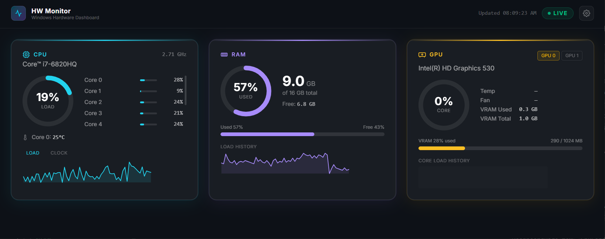
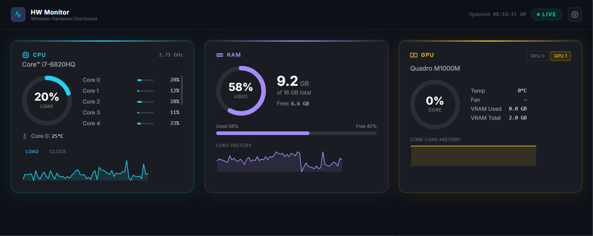
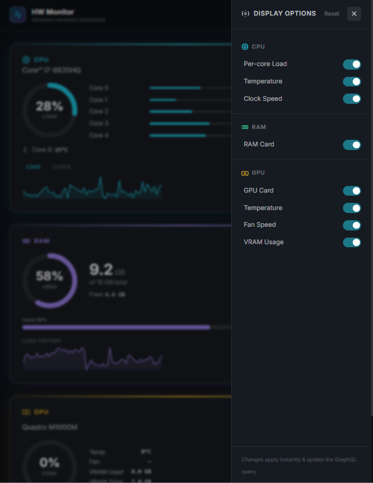

# Hardware Monitor — Dashboard UI

A real-time Windows hardware monitoring dashboard built with **React 19**,
**Apollo Client**, and **TailwindCSS**. Connects to the GraphQL server via
**WebSocket subscriptions** for live CPU, RAM, and GPU metrics.

<div style="display: grid; grid-template-columns: 1.6fr 1fr; gap: 12px; align-items: center; margin: 20px 0;">
  <div style="display: flex; flex-direction: column; gap: 12px;">
    
    
  </div>
  <div>
    
  </div>
</div>

## Stack

| | Technology |
|---|---|
| Framework | React 19 + TypeScript |
| Build tool | Vite 8 |
| Styling | TailwindCSS v4 (`@tailwindcss/vite`) |
| GraphQL | Apollo Client v4 |
| Realtime | GraphQL subscriptions over WebSocket (`graphql-ws` v6) |
| Typography | Inter (Google Fonts) |

## Prerequisites

- Node.js 20+
- The [GraphQL server](../server/README.md) running on port 4000

## Quick Start

### 1. Install dependencies

```bash
cd ui
npm install
```

### 2. Copy and edit the env file

```bash
cp .env.sample .env
```

The defaults work out of the box if the server is on `localhost:4000`:

```env
VITE_GRAPHQL_HTTP_URL=http://localhost:4000/graphql
VITE_GRAPHQL_WS_URL=ws://localhost:4000/graphql
```

### 3. Start the dev server

```bash
npm run dev
```

Open **http://localhost:5173** — the dashboard connects immediately and
displays live data pushed by the server every 2 seconds.

## Available Scripts

| Command | Description |
|---|---|
| `npm run dev` | Start Vite dev server with HMR on port 5173 |
| `npm run build` | Type-check + bundle to `dist/` |
| `npm run preview` | Serve the production bundle locally |

## Environment Variables

| Variable | Default | Description |
|---|---|---|
| `VITE_GRAPHQL_HTTP_URL` | `http://localhost:4000/graphql` | Apollo HTTP endpoint for queries |
| `VITE_GRAPHQL_WS_URL` | `ws://localhost:4000/graphql` | Apollo WebSocket endpoint for subscriptions |

> Variables must be prefixed with `VITE_` to be exposed to the browser bundle.

## Project Structure

```
src/
├── graphql/
│   ├── client.ts        # Apollo Client — HTTP + WebSocket split link
│   ├── queries.ts       # HARDWARE_UPDATED subscription document
│   └── types.ts         # TypeScript interfaces mirroring the GraphQL schema
├── hooks/
│   ├── useHardware.ts   # Wraps useSubscription — returns live snapshot
│   └── useHistory.ts    # Persists rolling 60-point history to localStorage
├── components/
│   ├── ui/
│   │   ├── GlassCard.tsx    # Frosted-glass card base
│   │   ├── RingGauge.tsx    # Animated SVG arc gauge
│   │   ├── Sparkline.tsx    # SVG polyline history chart
│   │   ├── StatusBadge.tsx  # LIVE / CONNECTING / ERROR indicator
│   │   └── SensorRow.tsx    # Per-core bar with label and value
│   ├── hardware/
│   │   ├── CpuCard.tsx   # CPU gauge, per-core bars, LOAD/CLOCK sparkline tabs
│   │   ├── RamCard.tsx   # RAM gauge, used/free bar, load history sparkline
│   │   └── GpuCard.tsx   # Tab-per-GPU, VRAM bar, core load sparkline
│   └── layout/
│       └── Header.tsx    # Logo, last-updated timestamp, connection badge
└── pages/
    └── DashboardPage.tsx # Responsive 3-column grid + skeletons + error state
```

## Features

- **Real-time updates** via GraphQL subscriptions — no polling on the client side
- **Connection badge** — shows `LIVE` (green), `CONNECTING` (amber), or `ERROR` (red)
- **Sparkline history** — 60-point rolling chart persisted to `localStorage`
  so trends survive a page refresh
- **Multi-GPU tabs** — each GPU gets its own tab inside a single card
- **Skeleton loaders** — glass-morphism placeholders shown while connecting
- **Error banner** — friendly message if the subscription drops
- **Responsive layout** — two-column (CPU + RAM) above GPU on wider screens;
  stacks to single column on narrow viewports

## How Subscriptions Work

```
Browser                               Server
  │                                     │
  │── WebSocket handshake ─────────────▶│
  │◀─ connection_ack ───────────────────│
  │── subscribe { hardwareUpdated } ───▶│
  │                                     │── poll hardware every 2 s
  │◀─ next { data: { hardwareUpdated } }│◀─ pubsub.publish(snapshot)
  │   (repeated every ~2 seconds)       │
```

Apollo Client's **split link** automatically routes `Subscription` operations
over WebSocket and `Query`/`Mutation` operations over HTTP.
